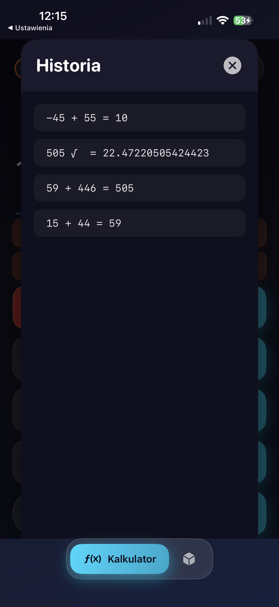

# ios-precision-calc


Dual-mode iOS calculator combining standard arithmetic with arbitrary-precision numbers and an interactive geometry calculator featuring SceneKit 3D visualization. Switch between precise everyday calculations and exploring 2D/3D shapes — all in one app.

## Screenshots

### Scientific Calculator

<p align="center">
  &nbsp;&nbsp;
  &nbsp;&nbsp;
  
</p>

<p align="center">
  <sub>Empty state with scientific functions · Expression input (<code>-45 + 55</code>) · Result display (<code>10</code>)</sub>
</p>

### Precision & Advanced Functions

<p align="center">
  &nbsp;&nbsp;
  &nbsp;&nbsp;
  
</p>

<p align="center">
  <sub>Arithmetic result (<code>505</code>) · Square root with full precision (<code>22.47220505424423</code>) · Calculation history overlay</sub>
</p>

### Geometry — 2D Shapes

<p align="center">
  
</p>

<p align="center">
  <sub>Square (side = 12): annotated diagram with side, perimeter, area, and diagonal results</sub>
</p>

### Geometry — 3D Shapes with SceneKit

<p align="center">
  &nbsp;&nbsp;
  &nbsp;&nbsp;
  
</p>

<p align="center">
  <sub>Interactive 3D renders — Sphere (r = 12) · Cube (edge = 22) with volume &amp; surface area · Cone (r = 25, h = 55) with full results</sub>
</p>

---

## Features

### Standard Calculator
- **Arbitrary Precision Arithmetic** — custom `BigNumber` class supporting infinite-digit calculations with no overflow
- **Scientific Functions** — sin, cos, tan, ln, log, square root, exponentiation, factorial
- **DEG/RAD Toggle** — switch between degree and radian modes for trigonometric functions
- **Calculation History** — browse and revisit all previous calculations
- **Core Operations** — addition, subtraction, multiplication, division with full decimal support
- **Negative Number Support** — handles negative values and mixed-sign expressions
- **Animated Gradient Backgrounds** — smooth, visually appealing animated gradients

### Geometry Calculator

#### 2D Shapes (9)
Circle, Rectangle, Triangle, Square, Hexagon, Ellipse, Parallelogram, Trapezoid, Rhombus

#### 3D Shapes (8)
Sphere, Cube, Rectangular Prism, Cylinder, Cone, Pyramid, Torus

- **SceneKit 3D Rendering** — interactive 3D previews of every solid shape with rotation and zoom
- **Annotated Diagrams** — labeled 2D shape diagrams with dimension annotations
- **Area & Volume** — automatic computation of area (2D) and surface area / volume (3D)
- **Additional Properties** — diagonals, slant heights, perimeters, and more

## Tech Stack

| Layer | Technology |
|---|---|
| Language | Swift |
| UI Framework | SwiftUI |
| 3D Rendering | SceneKit |
| Arithmetic | Custom BigNumber implementation |
| Animations | SwiftUI gradient animations |

## Getting Started

### Requirements

- Xcode 15.0 or later
- iOS 16.0+ deployment target
- macOS Ventura or later (for building)

### Installation

```bash
git clone https://github.com/selter2001/ios-precision-calc.git
cd ios-precision-calc
open ios-kalkulator.xcodeproj
```

Select your target device or simulator and press **Cmd + R** to build and run.

## Architecture

The project is organized around SwiftUI views with a dedicated `BigNumber` type handling all arithmetic:

```
├── App
│   └── ios-kalkulator/
├── Views
│   ├── ContentView.swift
│   ├── StandardCalculatorView.swift
│   └── GeometryCalculatorView.swift
├── Models
│   ├── CalculatorEngine.swift
│   └── GeometryModels.swift
└── SceneKit
    └── (3D shape scene builders)
```

- **CalculatorEngine / BigNumber** — custom arbitrary-precision number class supporting addition, subtraction, multiplication, and division without native type limitations
- **GeometryModels** — data definitions for all 2D and 3D shapes with formula computations
- **GeometryCalculatorView** — unified view with input forms, results, and SceneKit 3D previews for each shape
- **StandardCalculatorView** — full-featured calculator interface with BigNumber-backed operations

## Author

**Wojciech Olszak** — [@selter2001](https://github.com/selter2001)

## License

This project is licensed under the MIT License. See the [LICENSE](LICENSE) file for details.

---

# ios-precision-calc


Dwutrybowy kalkulator na iOS laczacy standardowa arytmetyke z liczbami o dowolnej precyzji oraz interaktywny kalkulator geometryczny z wizualizacja 3D w SceneKit. Przelaczaj sie miedzy precyzyjnymi codziennymi obliczeniami a eksploracja ksztaltow 2D/3D — wszystko w jednej aplikacji.

## Zrzuty ekranu

### Kalkulator naukowy

<p align="center">
  &nbsp;&nbsp;
  &nbsp;&nbsp;
  
</p>

<p align="center">
  <sub>Stan poczatkowy z funkcjami naukowymi · Wprowadzanie wyrazenia (<code>-45 + 55</code>) · Wyswietlanie wyniku (<code>10</code>)</sub>
</p>

### Precyzja i funkcje zaawansowane

<p align="center">
  &nbsp;&nbsp;
  &nbsp;&nbsp;
  
</p>

<p align="center">
  <sub>Wynik arytmetyczny (<code>505</code>) · Pierwiastek z pelna precyzja (<code>22.47220505424423</code>) · Nakladka historii obliczen</sub>
</p>

### Geometria — Figury 2D

<p align="center">
  
</p>

<p align="center">
  <sub>Kwadrat (bok = 12): opisany diagram z bokiem, obwodem, polem i przekatna</sub>
</p>

### Geometria — Bryly 3D z SceneKit

<p align="center">
  &nbsp;&nbsp;
  &nbsp;&nbsp;
  
</p>

<p align="center">
  <sub>Interaktywne rendery 3D — Kula (r = 12) · Szescian (krawedz = 22) z objetoscia i polem powierzchni · Stozek (r = 25, h = 55) z pelnym zestawem wynikow</sub>
</p>

---

## Funkcje

### Kalkulator standardowy
- **Arytmetyka dowolnej precyzji** — wlasna klasa `BigNumber` obslugujaca obliczenia na nieskonczonej liczbie cyfr bez przepelnienia
- **Funkcje naukowe** — sin, cos, tan, ln, log, pierwiastek kwadratowy, potegowanie, silnia
- **Przelacznik DEG/RAD** — tryb stopni i radianow dla funkcji trygonometrycznych
- **Historia obliczen** — przegladanie i powrot do wczesniejszych obliczen
- **Podstawowe operacje** — dodawanie, odejmowanie, mnozenie, dzielenie z pelna obsluga liczb dziesietnych
- **Obsluga liczb ujemnych** — wartosci ujemne i wyrazenia mieszane
- **Animowane tla gradientowe** — plynne, estetyczne animowane gradienty

### Kalkulator geometryczny

#### Ksztalty 2D (9)
Kolo, Prostokat, Trojkat, Kwadrat, Szesciokat, Elipsa, Rownoleglobok, Trapez, Romb

#### Ksztalty 3D (8)
Sfera, Szescian, Prostopadloscian, Walec, Stozek, Ostroslup, Torus

- **Rendering 3D w SceneKit** — interaktywne podglady 3D kazdej bryly z obrotem i zoomem
- **Opisane diagramy** — rysunki figur 2D z oznaczonymi wymiarami
- **Pole i objetosc** — automatyczne obliczanie pola (2D) oraz pola powierzchni / objetosci (3D)
- **Dodatkowe wlasciwosci** — przekatne, tworzace, obwody i wiecej

## Stos technologiczny

| Warstwa | Technologia |
|---|---|
| Jezyk | Swift |
| Framework UI | SwiftUI |
| Rendering 3D | SceneKit |
| Arytmetyka | Wlasna implementacja BigNumber |
| Animacje | Animacje gradientow SwiftUI |

## Jak zaczac

### Wymagania

- Xcode 15.0 lub nowszy
- Target wdrozeniowy iOS 16.0+
- macOS Ventura lub nowszy (do kompilacji)

### Instalacja

```bash
git clone https://github.com/selter2001/ios-precision-calc.git
cd ios-precision-calc
open ios-kalkulator.xcodeproj
```

Wybierz urzadzenie docelowe lub symulator i nacisnij **Cmd + R**, aby zbudowac i uruchomic projekt.

## Architektura

Projekt jest zorganizowany wokol widokow SwiftUI z dedykowanym typem `BigNumber` obslugujacym cala arytmetyke:

```
├── App
│   └── ios-kalkulator/
├── Views
│   ├── ContentView.swift
│   ├── StandardCalculatorView.swift
│   └── GeometryCalculatorView.swift
├── Models
│   ├── CalculatorEngine.swift
│   └── GeometryModels.swift
└── SceneKit
    └── (buildery scen ksztaltow 3D)
```

- **CalculatorEngine / BigNumber** — wlasna klasa liczbowa o dowolnej precyzji, obslugujaca dodawanie, odejmowanie, mnozenie i dzielenie bez ograniczen typow natywnych
- **GeometryModels** — definicje danych dla wszystkich ksztaltow 2D i 3D z obliczeniami wzorow
- **GeometryCalculatorView** — zunifikowany widok z formularzami, wynikami i podgladami 3D SceneKit dla kazdego ksztaltu
- **StandardCalculatorView** — pelnofunkcyjny interfejs kalkulatora oparty na operacjach BigNumber

## Autor

**Wojciech Olszak** — [@selter2001](https://github.com/selter2001)

## Licencja

Projekt jest objety licencja MIT. Szczegoly w pliku [LICENSE](LICENSE).
